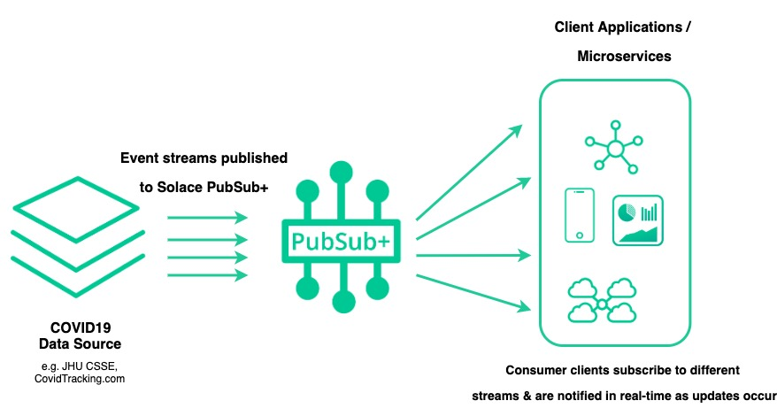
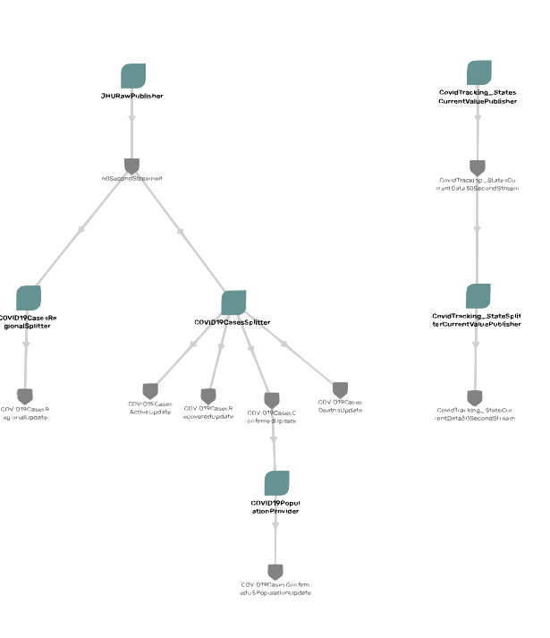

Table of Contents
=================
   * [Overview](#overview)
   * [COVID-19 Stream Processor](#covid-19-stream-processor)
      * [How to consume](#how-to-consume)
         * [1. Connection information](#1-connection-information)
            * [Connections credentials](#connections-credentials)
               * [Credentials](#credentials)
               * [Connection Points](#connection-points)
         * [2. Choose your Topics](#2-choose-your-topics)
            * [Streams are available on these topics](#streams-are-available-on-these-topics)
            * [Example topic subscription](#example-topic-subscription)
         * [3. Create your application](#3-create-your-application)
            * [Sample Applications](#sample-applications-to-get-started-quickly)
            * [COVID19 Stream Processors](#covid19-stream-processors)
      * [Test Topics](#test-topics)
      * [Contribution](#contribution)
      * [Disclaimer](#disclaimer)

# Overview
A team at Johns Hopkins University has developed this [interactive web-based dashboard](https://www.arcgis.com/apps/opsdashboard/index.html#/bda7594740fd40299423467b48e9ecf6) to provide researchers, public health authorities, and the general public with a user-friendly tool to track the COVID-19 pandemic as it unfolds. Their team has also been nice enough to periodically (usually once or twice a day) upload the data to this [Github Repo](https://github.com/CSSEGISandData/COVID-19) which has been very popular in the developer community, but has led to developers wanting to receive updates in a more efficient manner. To further their teams’ efforts, help the community, and to “do our part” we at Solace have created an application which polls the feature service, looks for differences in the data and publish updates into an Event Broker we are making available for public use. This allows anyone to consume data updates in near real-time and decrease the load on JHU’s own servers. The data is being published into the event brokers using dynamic topics which allows subscribers to pick, choose and filter on the specific data that they want to consume, e.g.,  a developer could choose to only get updated when an update it available for a specific Country & Province/State that they are interested in. This repository shares the information needed for anyone to consume these event streams :)

# COVID-19 Stream Processor

This repo provides streams information and example applications on how to consume the different topics available for consumption. The event streams published are processed directly from the [Johns Hopkins University Center for Systems Science and Engineering (JHU CSSE)](https://systems.jhu.edu/) available data. Any client application could consume those streams by subscribing to the topic of choice as per the diagram below. Note that the streams are provided over Solace PubSub+ Event Broker that has built-in support for a variety of open standard protocols and APIs.

 

## How to consume
### 1. Connection information

Connect to the PubSub+ broker using one of the connection end points below. For more details, check out the [Solace Developer Portal](https://www.solace.dev) and the [API docs](https://docs.solace.com/APIs.htm) samples for the different messaging APIs and protocols  

#### Connections credentials
##### Credentials
`MessageVPN` : `covid-19-streams`  
`Client Username` : `covid-public-client`  
`Client Password`: `covid19` 

##### Connection Points
| API/Protocol | Host |
|:---------- |:--------
|`SMF Host`|`tcp://mr2r9za6fwi0wf.messaging.solace.cloud:55555`|
|`Web Messaging Host`|`ws://mr2r9za6fwi0wf.messaging.solace.cloud:80`|
|`MQTT Host`|`tcp://mr2r9za6fwi0wf.messaging.solace.cloud:1883`|
|`Secured MQTT Host`|`ssl://mr2r9za6fwi0wf.messaging.solace.cloud:8883`|
|`WebSocket MQTT Host`|`ws://mr2r9za6fwi0wf.messaging.solace.cloud:8000`|
|`AMQP 1.0`|`amqp://mr2r9za6fwi0wf.messaging.solace.cloud:5672`|

Note: if you want to receive notifications via a REST end point that supports `POST`, contact us at covid19-project@solace.com

### 2. Choose your Topics

#### Streams are available on these topics
As of right now, the following is the list of streams available for consumption 

|  Description| Schema| Topic| Notes
| ---- |----|-------| --- |
| Raw data for all countries published every ~45 seconds |[Raw Data Schema](./schemas/RawJHUCSSUCOVID19.json) | `jhu/csse/covid19/raw`| |
| Updated Active/Deaths/Confirmed/Recovered for a region/state in one event | [Regional Update Schema](./schemas/COVID19UpdateSchema.json) | `jhu/csse/covid19/cases/region/update/{attributes.countryRegion}/{attributes.provinceState}`| |
| Updated Deaths for a region/state | [Update Type Schema](./schemas/COVID19UpdateTypeSchema.json) | `jhu/csse/covid19/cases/deaths/update/{attributes.countryRegion}/{attributes.provinceState}`| |
| Updated Active cases for a region/state | [Update Type Schema](./schemas/COVID19UpdateTypeSchema.json) | `jhu/csse/covid19/cases/active/update/{attributes.countryRegion}/{attributes.provinceState}`| |
| Updated Confirmed cases for a region/state | [Update Type Schema](./schemas/COVID19UpdateTypeSchema.json) | `jhu/csse/covid19/cases/confirmed/update/{attributes.countryRegion}/{attributes.provinceState}`| |
| Updated Recovered cases for a region/state |[Update Type Schema](./schemas/COVID19UpdateTypeSchema.json) |  `jhu/csse/covid19/cases/recovered/update/{attributes.countryRegion}/{attributes.provinceState}`| |
| Shows the updated percentage of the population affected | [Update Population Schema](./schemas/COVID19UpdatePopulationStats.json) | `jhu/csse/covid19/cases/active/population/update/US/{attributes.provinceState}`|Only US for now |

Subscribe to one or more of the available topics above to receive the required data. 
**Note that the streams defined as *update* above only send events when updates actually occur which can be infrequently. For development purposes we are providing [test topics](#test-topics) that get published every few minutes**

For more more information on using topic wildcards check out [SMF Topic Subscriptions](https://docs.solace.com/PubSub-Basics/Wildcard-Charaters-Topic-Subs.htm) and [MQTT Topic Subscriptions](https://docs.solace.com/Open-APIs-Protocols/MQTT/MQTT-Topics.htm#Wildcard)

Note: If you have your own COVID-19 event stream that you'd like to share please contact us at covid19-project@solace.com

#### Example topic subscriptions
Subscribing to the following streams will give you the corresponding results:

| Subscription        | Result   
| ------------- |:-------------|
|`jhu/csse/covid19/cases/region/update/>`|All region updates|
|`jhu/csse/covid19/cases/region/update/US/>`|All updates for country US|
|`jhu/csse/covid19/cases/region/update/US/Florida`|All updates where state is Florida|
|`jhu/csse/covid19/cases/recovered/update/Canada/Ontario`|All recovered in Ontario, Canada|
|`jhu/csse/covid19/cases/active/update/Canada/*`|All active in Canada|
|`jhu/csse/covid19/cases/deaths/update/Brazil/*`|All deaths in Brazil (Note: country with no province/state)|
|`jhu/csse/covid19/cases/*/update/Diamond Princess/*`|All case types from the Diamond Princess cruise ship|

### 3. Create your application
After connecting and choosing the topics to listen on, its time to build your application. Check out the examples below for applications that consume the streams

#### Sample Applications to Get Started Quickly
| Application | Language | Description
| ---- | ---| --- |
| [Spring Cloud Stream Sample](./samples/SpringCloudStreamSample) | Java + Spring | This microservices shows how to consume events using the Spring Cloud Stream project which abstracts the messaging APIs from the developer and allows them to focus on implementing their business logic.
| [JavaScript Sample](./samples/JavaScriptSample)| JavaScript | This html page allows you to test out multiple topics and view the stream body response

#### COVID19 Stream Processors
Below are Spring Boot microservices that are being used to create the event current streams that are available for consumption. They are also good examples if you would like to consume the streams and republish them into an event broker. Note that they are not intended to be run with the provided credentials as we are running them as a services

| Application        | Version           | Integration  | Description |
| ------------- |:-------------:| :-----| :-----|
| [COVID19CaseSplitter](./stream-processors/COVID19CasesSplitter)      | 0.1 | Spring | This application consumes RAW JHU COVID19 data, and publishes smaller updates |
| [COVID19RegionalSplitter](./stream-processors/COVID19RegionalSplitter) | 0.1      |    Spring | This application consumes RAW JHU COVID19 data, splits it into regional updates and publishes smaller regional updates
| [COVID19PopulationProvider](./stream-processors/COVID19PopulationProvider)     | 0.1      |   Spring | This application publishes the percentage of population affected in the areas

Note: Contact us at covid19-project@solace.com to add more event stream into the current broker

## Test Topics
This section includes information about test streams that are available. Since actual updates can occur infrequently we are providing these test streams strictly for development purposes. Instead of only receiving events when updates occur, these topics, which include `test` as a level, will regularly receive events whether or not an update has actually occurred. Once you have completed development you should remove the `test` level from your topic and you’ll only receive events when actual updates occur.

|  Description| Schema| Topic| Notes
| ---- |----|-------| --- |
| Updated Active/Deaths/Confirmed/Recovered for a region/state in one event | [Regional Update Schema](./schemas/COVID19UpdateSchema.json) | `jhu/csse/covid19/test/cases/region/update/{attributes.countryRegion}/{attributes.provinceState}`| |
| Updated Deaths for a region/state | [Update Type Schema](./schemas/COVID19UpdateTypeSchema.json) | `jhu/csse/covid19/test/cases/deaths/update/{attributes.countryRegion}/{attributes.provinceState}`| |
| Updated Active cases for a region/state | [Update Type Schema](./schemas/COVID19UpdateTypeSchema.json) | `jhu/csse/covid19/test/cases/active/update/{attributes.countryRegion}/{attributes.provinceState}`| |
| Updated Confirmed cases for a region/state | [Update Type Schema](./schemas/COVID19UpdateTypeSchema.json) | `jhu/csse/covid19/test/cases/confirmed/update/{attributes.countryRegion}/{attributes.provinceState}`| |
| Updated Recovered cases for a region/state |[Update Type Schema](./schemas/COVID19UpdateTypeSchema.json) |  `jhu/csse/covid19/test/cases/recovered/update/{attributes.countryRegion}/{attributes.provinceState}`| |
| Shows the updated percentage of the population affected | [Update Population Schema](./schemas/COVID19UpdatePopulationStats.json) | `jhu/csse/covid19/test/cases/active/population/update/US/{attributes.provinceState}`|Only US for now |

**Note that the `raw` stream is regulary updated every ~45 seconds**

## Contribution
See [Contribution guidelines](./CONTRIBUTING.md) form more details

## Credit
* Social Preview Image by [Gerd Altmann](https://pixabay.com/users/geralt-9301/?utm_source=link-attribution&amp;utm_medium=referral&amp;utm_campaign=image&amp;utm_content=3513216) from [Pixabay](https://pixabay.com/?utm_source=link-attribution&amp;utm_medium=referral&amp;utm_campaign=image&amp;utm_content=3513216)

## Disclaimer
1. As per Johns Hopkins University [Terms of Use](https://github.com/CSSEGISandData/COVID-19) this data is public strictly for educational and academic research purposes.
1. Data streams are provided and maintained by [Solace](https://www.solace.dev/) under the same terms of use.
